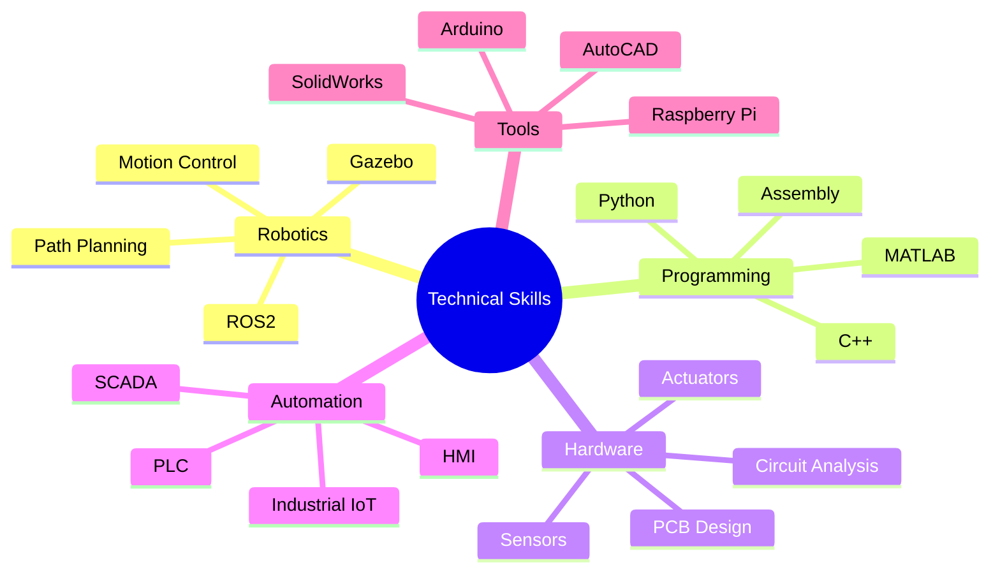

<div align="center">

```ascii
 __  __           _                           _ 
|  \/  | ___   __| |_   _   ___  ___   __ _(_)
| |\/| |/ _ \ / _` | | | | / __|/ _ \ / _` | |
| |  | | (_) | (_| | |_| | \__ \ (_) | (_| | |
|_|  |_|\___/ \__,_|\__, | |___/\___/ \__, |_|
                     |___/             |___/    
```

[](https://git.io/typing-svg)


</div>


# 👨‍💻 About Me

I'm a passionate Mechatronics Engineer specializing in robotics and automation systems. Currently pursuing my final year at Asia Pacific University, I combine theoretical knowledge with hands-on experience to create innovative solutions.

- 🎓 Final year Mechatronics Engineering student
- 💼 Intern at Kuwait Aviation Fuelling Company (KAFCO)
- 🔬 Research focus: ROS2 and Advanced Control Systems
- 🎯 Mission: Advancing robotics and automation technology
- ⚡ Fun fact: Hardware debugging is my superpower!

# 🚀 Current Focus

- Advanced Robotics Control Systems
- Industrial Automation Solutions
- Machine Learning Integration
- IoT Implementation
- Embedded Systems Development

# 💡 Technical Expertise

<div align="center">



</div>

# 🛠️ Technologies & Tools

<div align="center">


</div>

# 🌐 Let's Connect

<div align="center">

[](https://www.linkedin.com/in/mody-khairy-0023322ba/)
[](mailto:tp066167@mail.apu.edu.my)
[](https://github.com/mahmoud-khairy)

</div>

# 🏆 Featured Projects

<div align="center">

### Coming Soon!


</div>

---
<div align="center">
<i>Let's build the future of automation together! 🤖</i>
</div>
